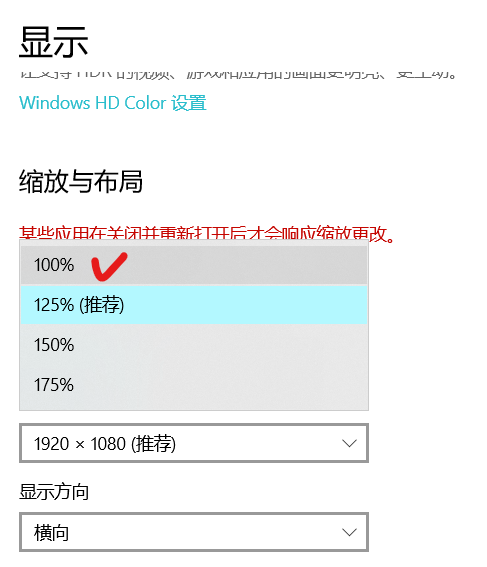

# Paperpilot-Autorun

## Step1 安装python和相关依赖

```bash
pip install cv2
pip install math
pip install time
pip install pyautogui
pip install datetime
```

## Step2 调整显示比例

开始-设置-显示设置  调整显示比例为100%



## Step2 标记关键点（先固定好窗口大小和位置！！）

运行 Utils/set_crucial_points.py 按照说明填写坐标

另起终端运行 Utils/find_mouse.py 可以实时看到鼠标指针位置，移动到对应点后，把数据填入set_crucial_points的终端里

**注意**

游戏界面可以尽可能大些，减小误差，但保证运行时无遮挡

最后对于数字显示框的两点标记，请在框的圆角内读取坐标 如下图


## Step3 在Mytest.py里面做修改即可

```python
if __name__ == "__main__":
    paradict = read_config()
    print(paradict)
    res = []
    df = pd.DataFrame(columns=('Type', 'Weight', 'Elevators', 'Winglets', 'theta', 'rou', 'result'))
    rows = 0
    # 从这里修改即可
    for wei in range(90, 101, 10):
        nowres = autorun.autorun(paradict, "A", wei, 20, 0, 55, 30, 1, True)
        res.append(nowres)
        df.loc[rows] = ["C", wei, 28, 0, 55, 30, nowres]
        rows += 1
    print(df)
    df.to_csv(file_addr)
```

autorun.autorun参数如下

1. params 存储各个关键点坐标的参数表

2. pType 纸飞机类型 可传入"A" "B" "C"

3. pWeight 传入数值

4. pEle 传入数值

5. Winglets 1或0 表示开或关
6. theta 人体弯腰角度
7. rou  手臂伸展距离
8. times 同一套参数玩几遍（经测试，这个仿真环境没有风力变化，同一套参数对应的结果一定是一样的）
9. replace 结束后是否将参数都归零 一般为True，便于后面继续自己跑

之后会保存为当前时间命名的csv文件中

#### 注意

1. 参数表保存的是屏幕中的像素点位置，set好后就不要再动屏幕了，如果移动了窗口位置或者放缩了需要重新写入关键点坐标
2. 运行时要保证游戏界面无遮挡，建议是将播放器设置为“常在顶端”
3. 游戏界面可以尽可能大些，可以减小误差
